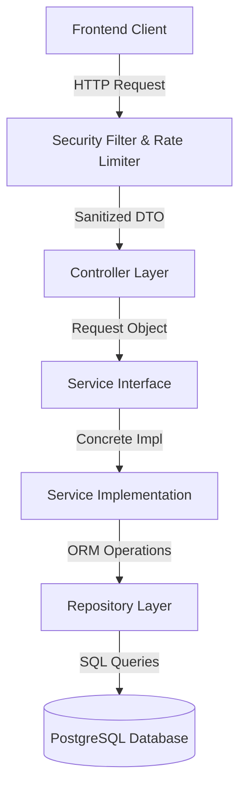
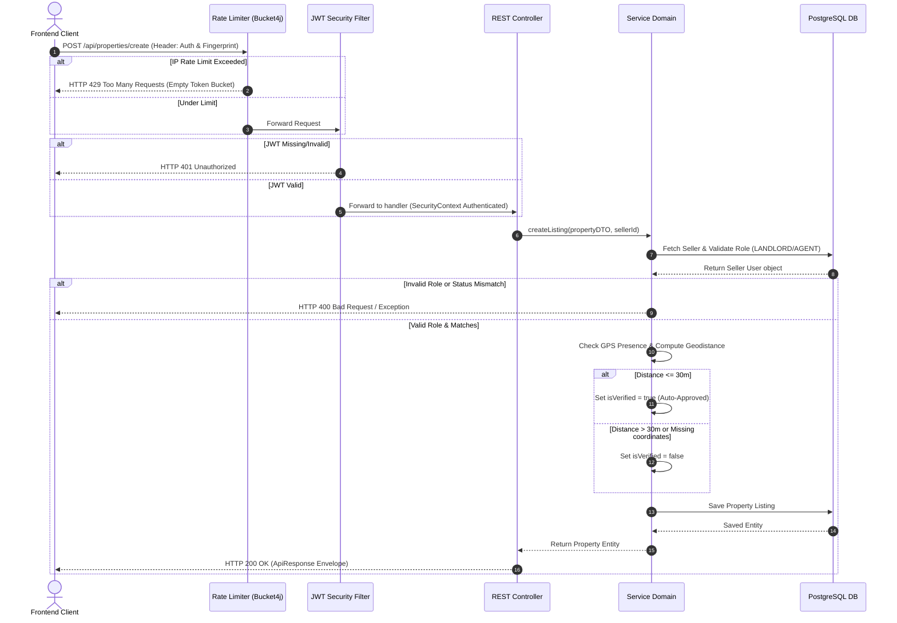
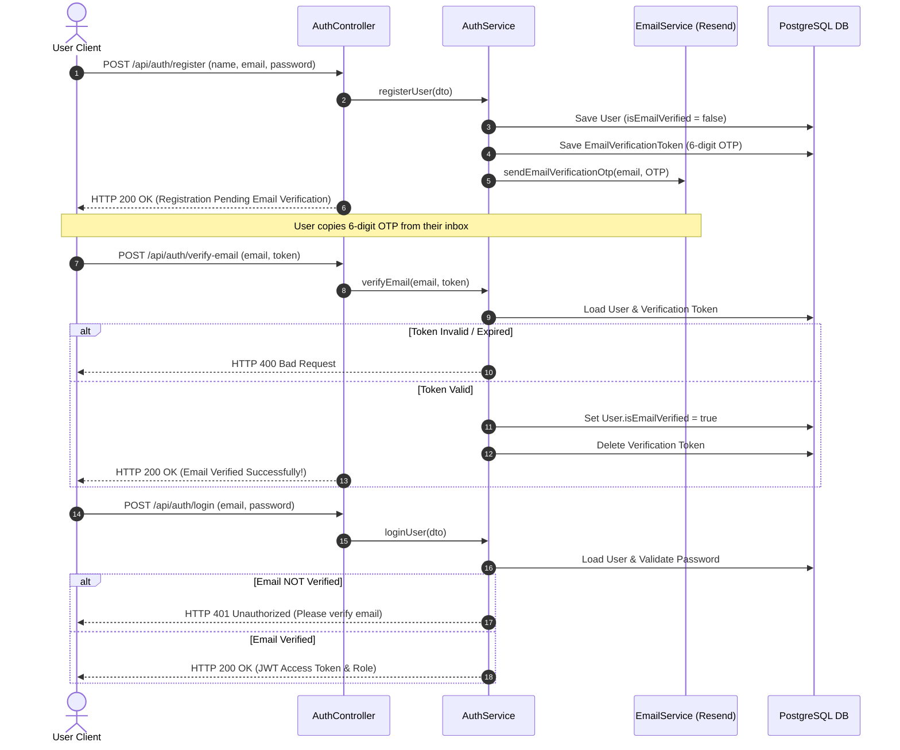
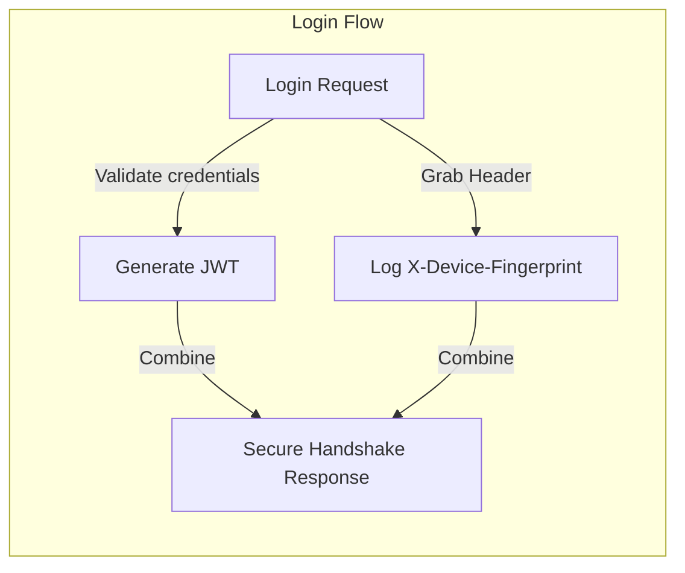
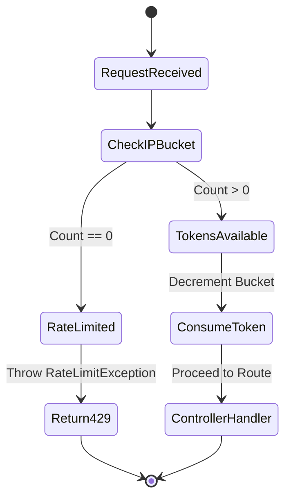
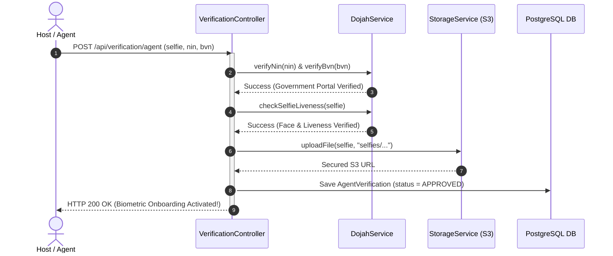
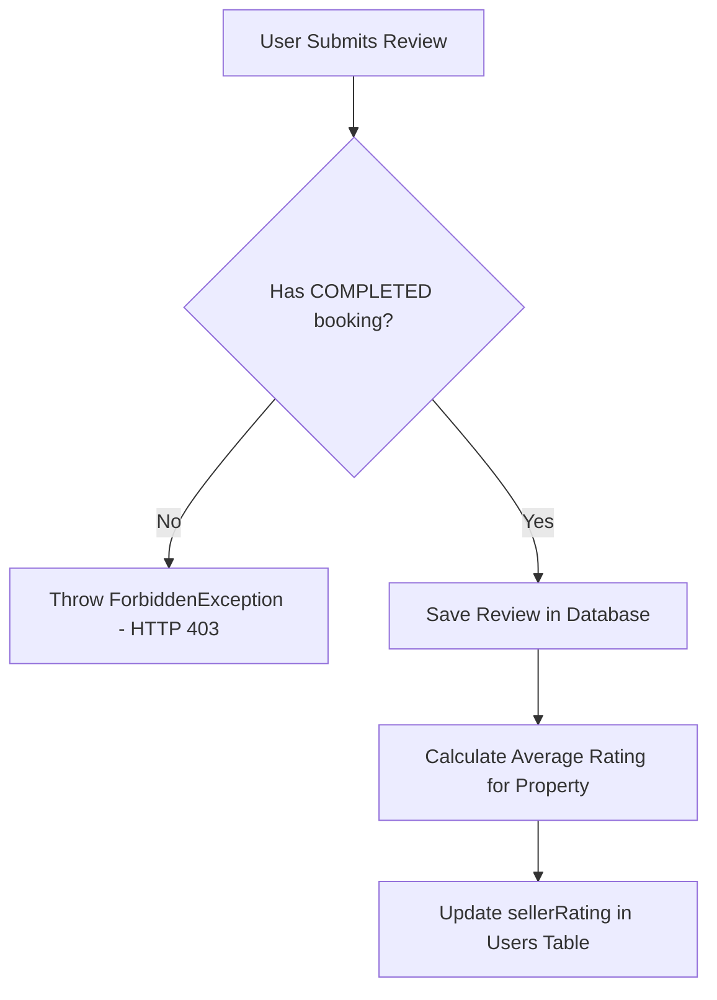

# 🏛️ Keyz Backend System Architecture

Welcome to the **Keyz System Architecture Guide**. This document provides an in-depth breakdown of the technical design, architectural patterns, directory structures, and core security workflows engineered into the Keyz real estate platform.

---

## 📋 Table of Contents
1. [Architectural Style & Layers](#-architectural-style--layers)
2. [Component Diagram & Flow](#-component-diagram--flow)
3. [Package Structure](#-package-structure)
4. [Core Architectural Features](#-core-architectural-features)
   - [A. Authentication & Security Design](#a-authentication--security-design)
   - [B. Rate Limiting Subsystem](#b-rate-limiting-subsystem)
   - [C. Trust & Verification Gating (KYB)](#c-trust--verification-gating-kyb)
   - [D. Transactional Trust (Bookings & Reviews)](#d-transactional-trust-bookings--reviews)
   - [E. Virtual Tours & Storage Integrations](#e-virtual-tours--storage-integrations)
5. [Standardized Error & Envelope System](#-standardized-error--envelope-system)

---

## 🏗️ Architectural Style & Layers

Keyz is architected around a **Modular Layered Architecture** with strictly typed data envelopes. All business capabilities are abstracted behind loose-coupling Java interfaces, enforcing clean separation of concerns, high testability, and flexible dependency injection.



### Layer Responsibilities

1.  **Controller Layer (`com.example.backend.controller`):**
    *   Exposes REST endpoints.
    *   Validates payload structure and fields (`@Valid`, `@NotNull`, etc.).
    *   Maps internal entity structures to API-friendly standardized envelopes (`ApiResponse<T>`).
2.  **Service Layer & Implementation (`com.example.backend.service` / `com.example.backend.service.impl`):**
    *   Implements core business domains (e.g. calculating dynamic pricing, verifying seller status).
    *   Enforces domain validation (e.g., throwing a `ForbiddenException` if a buyer tries to submit a review without a completed booking).
    *   Manages transaction boundaries using `@Transactional`.
3.  **Repository Layer (`com.example.backend.repository`):**
    *   Interfaces extending `JpaRepository` for ORM database operations.
    *   Executes native and JPQL queries (e.g., fetching listings by verification status).
4.  **Security & Interceptor Infrastructure:**
    *   Inspects HTTP requests globally to manage JWT extraction, token validity checks, device fingerprints, and Bucket4j IP rate limits.

---

## 📊 Component Diagram & Flow

This sequence diagram displays a complete HTTP cycle, including security validations, rate limiting, and business logic execution.



### 🔒 Email Onboarding Verification Flow

This sequence diagram outlines the onboarding gate. It displays the process of registering an account, generating and emailing a 6-digit verification OTP, enforcing active verification blockers on login, and activating the account.



---

## 📁 Package Structure

Below is the directory design of the backend source tree.

```
src/main/java/com/example/backend/
│
├── config/                     # System-wide Bean configurations
│   ├── OpenApiConfig.java      # Swagger UI and JWT Bearer Security Setup
│   ├── RateLimitInterceptor.java # Bucket4j IP-based Request Throttler
│   ├── S3Config.java           # Amazon Web Services S3 Credentials
│   └── WebConfig.java          # Interceptor Registrations & CORS Rules
│
├── controller/                 # REST Controller Entrypoints
│   ├── AuthController.java     # Authentication, Login, Recovery
│   ├── BookingController.java  # Rental Bookings
│   ├── OfferController.java    # Purchasing Offers
│   ├── PropertyController.java # Listing management
│   ├── ReviewController.java   # Ratings & Reviews
│   ├── VerificationController.java # KYB & Property ownership verification
│   └── VirtualTourController.java # Walkthrough Uploads & Live Jitsi sessions
│
├── dto/                        # Data Transfer Objects
│   ├── request/                # Inbound request bodies
│   └── response/               # Outbound standardized payloads
│
├── exception/                  # Error infrastructure
│   ├── GlobalExceptionHandler.java # @ControllerAdvice catching exceptions globally
│   └── [CustomExceptions].java # ForbiddenException, ResourceNotFoundException, etc.
│
├── model/                      # JPA Entities (Database Table Mapping)
│   ├── Booking.java            # Booking status, range, and cost
│   ├── User.java               # Auth user credentials, roles, and aggregate rating
│   ├── Property.java           # Housing descriptions, coordinates, tour URLs
│   └── [Others].java           # KybVerification, DeviceFingerprint, Review, etc.
│
├── repository/                 # Database Query Definitions (Spring Data JPA)
│
├── security/                   # Spring Security & JWT Filter chain
│   ├── JwtAuthenticationFilter.java # Custom filter extracting Bearer JWTs
│   ├── JwtService.java         # Signer, parser, and username extractor
│   └── SecurityConfig.java     # Security filters, CORS configurations, RBAC permissions
│
└── service/                    # Business Domain Layer
    ├── impl/                   # Concrete business logic files
    └── [Interfaces].java       # Decoupling definitions
```

---

## ⚙️ Core Architectural Features

### A. Authentication & Security Design
Security is baked into every layer of Keyz:
1.  **JWT stateless Auth:** The client authenticates via `/api/auth/login` and receives a cryptographically signed JWT token. The token is verified on every secure endpoint by `JwtAuthenticationFilter` without hitting the database for session state.
2.  **Device Fingerprinting:** Every registration and login logs the client's `X-Device-Fingerprint` and `User-Agent`. This links trusted device fingerprints to users in the `DeviceFingerprint` model to track credentials across devices and alert on anomalous sign-ins.
3.  **Spring Security Integration:** Endpoint security policies are managed in `SecurityConfig.java` to block unauthenticated requests and route traffic according to roles (`LANDLORD`, `AGENT`, `TENANT`, `ADMIN`).



### B. Rate Limiting Subsystem
To defend against DDoS, brute force attacks, and heavy scraping, the backend implements an IP-based token-bucket rate limiter via `Bucket4j`.
*   **Mechanism:** Registered as a global Web MVC `HandlerInterceptor` (`RateLimitInterceptor.java`).
*   **Rules:** Every unique IP address receives a bucket containing **100 tokens** per minute.
*   **Refill:** Buckets refill dynamically at a rate of 100 tokens per minute.
*   **Response:** Exhausted buckets trigger an immediate `429 Too Many Requests` status, bypassing execution of database or controller operations entirely.



### C. Trust, Verification Gating & Dojah Integration
To maintain a secure, fraud-free ecosystem, listings, hosts, and payout profiles are governed by 100% automated trust gates:

1.  **Instant Agent Onboarding (Dojah Biometrics):**
    *   **Registry Audit:** Verifies the host's National Identification Number (NIN) and Bank Verification Number (BVN) against government databases.
    *   **Biometric Selfie Check:** Conducts liveness checks to block deepfakes and performs dynamic facial matching.
    *   **Instant Activation:** Upon successful biometric and database matching, the agent's registration status is automatically set to APPROVED.
2.  **Email Verification Onboarding Gate:**
    *   New user accounts are initialized as unverified.
    *   An automated 6-digit numeric OTP email is sent via Resend upon registration.
    *   Login is completely blocked until the user submits their OTP and completes verification, removing fake accounts.
3.  **Geofenced Proof-of-Presence Verification:**
    *   When photos are uploaded, the backend extracts the camera hardware's GPS latitude and longitude parameters.
    *   The system checks this physical coordinate against the geocoded address location.
    *   If the distance is under twenty meters, the listing's presence is auto-verified.
4.  **Automated Utility Bill OCR Verification:**
    *   Amazon Textract scans uploaded utility statements.
    *   Fuzzy name and address matching algorithms confirm that the verified host is the bill-paying tenant or owner of that exact physical property address (enforcing a sixty percent token matching threshold).
5.  **Computer Vision Duplicate listing Detector:**
    *   Computes a sixty-four-bit Average Perceptual Hash (aHash) for all uploaded property photos.
    *   Scans active listing hashes in the database using Hamming Distance matching.
    *   If a photo matches an existing listing by a different host (five bits or fewer difference), the listing is immediately deactivated and flagged as a duplicate.
6.  **Financial Payout Micro-Deposits:**
    *   Enforces that the banking payout account name matches the host's Dojah verified legal first and last name.
    *   Generates two random decimal micro-deposits.
    *   The host confirms these amounts order-independently to activate their payout routing.



---

### D. Transactional Trust (Bookings & Reviews)
To prevent review manipulation and fake ratings:
1.  **Booking Validation:** Bookings can only be placed on verified (`isVerified = true`) properties matching the `FOR_RENT` status. Total prices are calculated dynamically using the date span and daily rental price.
2.  **Reviews Pre-condition:** A user is blocked from submitting a review (`POST /api/reviews`) unless they have a corresponding `Booking` on the target property marked as `COMPLETED`. Attempting to review an unvisited property returns a strict `403 Forbidden`.
3.  **Aggregate Rating Engine:** When a verified review is saved, a database transaction is triggered to calculate the average score of all properties belonging to the seller. This recalculates the seller's aggregate score (`sellerRating` inside the `User` model) in real time.



### E. Virtual Tours & Storage Integrations
To offer realistic virtual real estate viewings:
*   **Jitsi JaaS integration:** For live tours, the backend acts as a cryptographic signing server. It loads a secure RSA private key to generate a signed JWT room token. This grants private, authorized access to an 8x8 Jitsi web conference, bypassing direct client connection to private Jitsi credentials.
*   **Multipart Walkthroughs on AWS S3:** Sellers can upload MP4 videos (`/api/tours/upload/{propertyId}`). The file stream is piped directly to Amazon S3 via `software.amazon.awssdk:s3`, returning a secured public S3 URL saved as `videoWalkthroughUrl` inside the property record.

---

## ✉️ Standardized Error & Envelope System

Every REST response is mapped to a standard `ApiResponse` envelope, ensuring a consistent payload layout for the frontend:

### Success Envelope
```json
{
  "success": true,
  "message": "Property fetched successfully",
  "data": {
    "id": 1,
    "title": "Vibrant Lekki Penthouse",
    "price": 450000.00
  }
}
```

### Error Exception Handler Envelope
```json
{
  "success": false,
  "message": "Resource with ID 15 not found",
  "data": null
}
```

> [!NOTE]
> All uncaught runtime exceptions (e.g. `NullPointerException`, `BadCredentialsException`, or custom business validation exceptions) are automatically intercepted by the `GlobalExceptionHandler` and safely converted into an `ApiResponse` failure envelope with appropriate HTTP status codes, preventing raw stack traces from leaking to clients.
