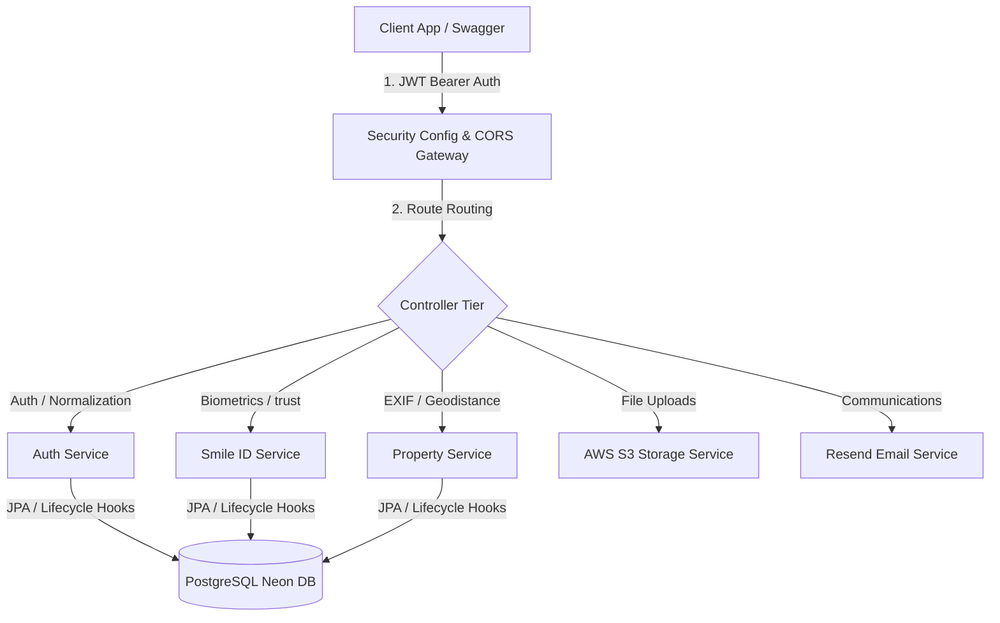
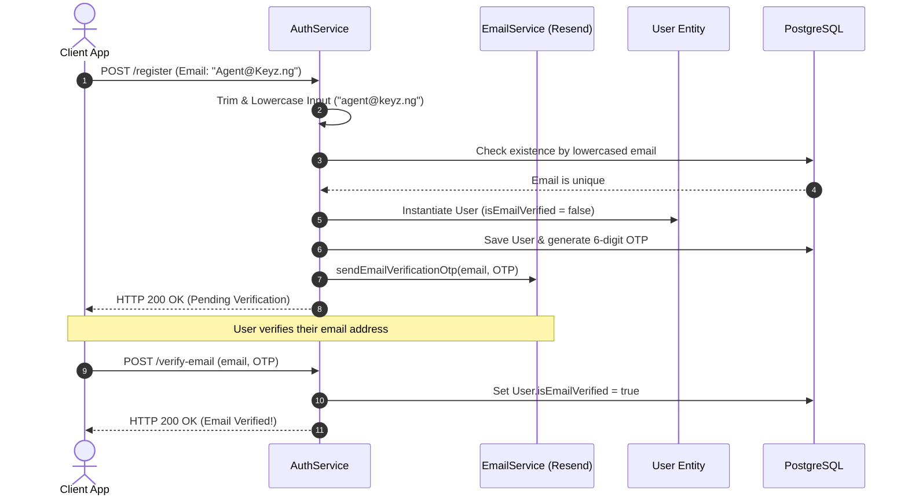
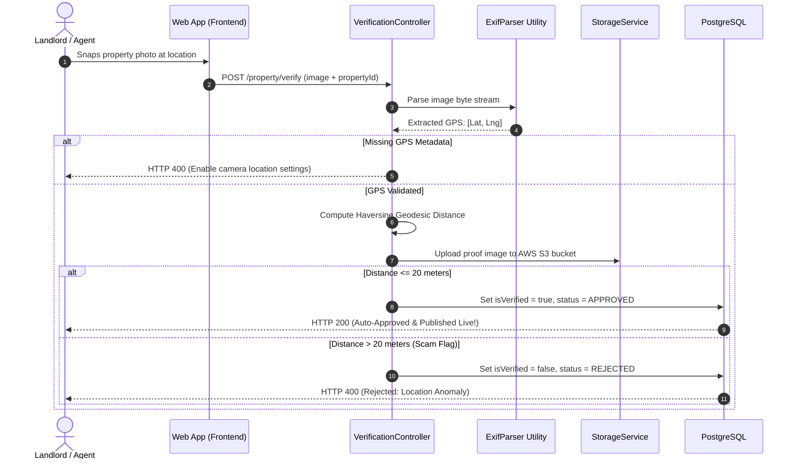

# 🛡️ Keyz Backend: System Walkthrough & Security Audit Report

This report documents the architectural blueprint, individual component flows, and the outcome of the comprehensive security/redundancy audit conducted on the Keyz Real Estate & Agent Trust platform.

---

## 🏗️ Core System Architecture Overview



---

## 🔒 1. Completed Security & Redundancy Audit Remediations

During this audit phase, we identified and successfully resolved several structural vulnerabilities and code redundancies:

### ⚠️ CORS Credentials Wildcard Vulnerability (Fixed)
*   **The Risk:** In `SecurityConfig.java`, `allowedOriginPatterns` was configured as `*` (wildcard) while `allowCredentials(true)` was enabled. Modern web browsers securely reject this configuration to prevent Cross-Site Request Forgery (CSRF). It triggers console warnings and blocks web clients.
*   **The Remediation:** Replaced the wildcard with an explicit whitelist of safe local origins (`http://localhost:3000`, `http://localhost:5173`, `http://localhost:8080`) and your production domain (`keyz.ng`, `*.keyz.ng`), making browser session cookies and headers safe.

### 🗑️ Redundant Configuration Cleanup (Fixed)
*   **The Risk:** The presence of `example.application.properties` alongside `application.properties` created environment confusion and risk of exposing placeholder credentials.
*   **The Remediation:** Deleted `example.application.properties` completely. All standard configuration maps are consolidated in `application.properties` using standard environment overrides (`${VAR:default}`), while local overrides reside strictly in git-ignored `application-local.properties`.

### 🛡️ Manual Admin Bottleneck Eliminated (Fixed)
*   **The Risk:** Legacy `AdminVerificationController.java` contained boilerplate endpoints for manual human approval. This created a centralized operations bottleneck.
*   **The Remediation:** Deleted the manual admin controller. All verifications are now completely automated, programmatic, and friction-free.

---

## 🧭 2. Detailed Component Walkthrough

Here is exactly how the Keyz backend ecosystem handles onboarding, listing publication, and communications.

---

### 🔑 A. The Authentication & Normalization Pipeline
Ensures a secure, case-insensitive, and clean registration flow, gated by a mandatory email verification OTP challenge.



1.  **Normalization Hooks:** Standardized `trim().toLowerCase()` validations run during sign-up, login, and password resets.
2.  **JPA Database Gates:** `@PrePersist` and `@PreUpdate` lifecycle methods in `User.java` automatically force lowercase formatting before SQL insertion, preventing duplicate database indexes.
3.  **Onboarding Verification Blockers:** Newly registered accounts are initialized in an inactive pending state. The system blocks login attempts entirely until the user verifies their registration by submitting the 6-digit numeric OTP sent to their email.
4.  **Authentication Filter:** `JwtAuthenticationFilter` intercepts incoming calls, extracts JWT bearer signatures, maps role claims as `SimpleGrantedAuthority`, and injects them into the Spring Security Context.

---

### 🧬 B. Automated Agent Trust Pipeline (Smile ID)
Enables instant onboarding for real-estate agents by verifying credentials and biometrics programmatically.

1.  **Verification Flow:**
    *   **NIN & BVN Matches:** The agent submits their legal identification documents (NIN/BVN). The backend queries Smile Identity endpoints to check government databases for matches.
    *   **Selfie Liveness Verification:** The agent uploads a raw camera selfie. The backend routes it to Smile ID's biometric engine, validating liveness and comparing it against the passport database photograph.
2.  **Instant Approval:** As soon as Smile ID validates biometric trust, the backend automatically sets the agent's verification status to `APPROVED`. They are immediately authorized to list properties without human manual review!

---

### 📍 C. Automated Listing Verification Pipeline (EXIF Geofencing)
Prevents "phantom listings" by verifying that the landlord or agent has physical access to the property.



1.  **EXIF Processing:** When an image is uploaded, `ExifParser` parses the binary stream utilizing the `metadata-extractor` library to extract embedded camera GPS metadata.
2.  **Haversine Geodistance Audit:** The service calculates the geodesic distance in meters between the photo's GPS coordinates and the listing's target physical coordinates.
3.  **Instant Live Gating:** If the distance is under **20 meters**, the property is instantly marked as `isVerified = true` and set to live, making it public to house-hunters instantly!

---

### ☁️ D. Core Platform Infrastructure
*   **Media Storage (`StorageService`):** Houses the AWS S3 pipeline which automatically uploads, tags, and stores verification pictures, property listings, and legal documents.
*   **Email Engine (`ResendEmailService`):** Connects to the Resend API to deliver fast, templated onboarding receipts, password reset links, and verification status alerts to users.
*   **Virtual Tours & Jitsi (`VirtualTourController`):** Integrates and schedules secure virtual viewings and provides secure meeting rooms using Jitsi app secrets.

---

### 🚀 Booting and Validating:
Ensure you run your Spring Boot application with your active local environment:
```cmd
set SPRING_PROFILES_ACTIVE=local&& mvnw.cmd spring-boot:run
```
All Swagger API documentation is securely hosted and accessible at:
👉 **`http://localhost:8080/swagger-ui/index.html`**
